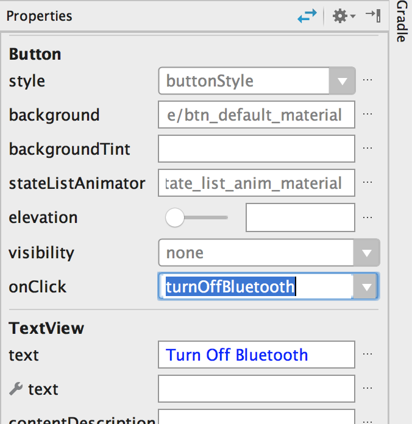

In this tutorial, we're going to learn how to use Bluetooth in our Android apps.  

Bluetooth is becoming increasingly popular in smart homes and smart devices. You can use it to connect your device to a smart watch, earphones, or another home appliance.


<h1></h1>

Let's first create a new project.  I'm going to call mine BluetoothDemo.  Unfortunately, you can't use Bluetooth on the simulator, but if you have an Android phone, you can connect it to your computer and run the code on your phone.  

The first thing we will need to include is our BluetoothAdapter variable BA.  This allows us to work with Bluetooth.  

First, we need to see if the user has Bluetooth turned on.  

<p>Use the .isEnabled() method to check if Bluetooth is enabled.  If it is, you can make a toast that tells the user that Bluetooth is on on their device. </p>

```
BluetoothAdapter BA;


    public void turnBluetoothOff (View view) {

        BA.disable();

        if (BA.isEnabled()) {

            Toast.makeText(getApplicationContext(), "Bluetooth could not be disabled", Toast.LENGTH_LONG).show();

        } else {

            Toast.makeText(getApplicationContext(), "Bluetooth turned off", Toast.LENGTH_LONG).show();

        }


    }
```


<p>We also have to include permission for Bluetooth in our AndroidManifest.xml file.</p>

<br>

```
<uses-permission android:name="android.permission.BLUETOOTH" />
<uses-permission android:name="android.permission.BLUETOOTH_ADMIN" />
```

<br>


We need to create an intent to go to our Bluetooth Adapter.  We will use ACTION_REQUEST_ENABLE to enable Bluetooth.

We then do another check to see if Bluetooth enabled, and then tell the user it is turned on. 

```
@Override
    protected void onCreate(Bundle savedInstanceState) {
        super.onCreate(savedInstanceState);
        setContentView(R.layout.activity_main);

        if (BA.isEnabled()) {

            Toast.makeText(getApplicationContext(), "Bluetooth is on", Toast.LENGTH_LONG).show();

        } else {

            Intent i = new Intent(BluetoothAdapter.ACTION_REQUEST_ENABLE);
            startActivity(i);

            if (BA.isEnabled()) {

                Toast.makeText(getApplicationContext(), "Bluetooth turned on", Toast.LENGTH_LONG).show();

            }

        }

    }
```


In our layout file, let's bring in a few buttons and a listView from the sidebar.


The first will be to turn Bluetooth off. 

The second will find nearby devices, such as earbuds or watches. 

Our third button will let us view paired devices (ones that are already paired with the phone)

Don't forget to set IDs and onClick (to do when the button is clicked) for all three buttons.

<br>
<br>



<br>
<br>

Now, give the listView the ID pairedDevicesListView.  

 

In MainActivity, we'll create the function "turnBluetoothOff"


We then need to add the permission to control Bluetooth. We will then check to see if Bluetooth is still enabled.  

```
public void turnBluetoothOff (View view) {

        BA.disable();

        if (BA.isEnabled()) {

            Toast.makeText(getApplicationContext(), "Bluetooth could not be disabled", Toast.LENGTH_LONG).show();

        } else {

            Toast.makeText(getApplicationContext(), "Bluetooth turned off", Toast.LENGTH_LONG).show();

        }


    }
```

```
Next, let's add an onClick for "findDiscoverableDevices"

This will go to a different intent.  

public void findDiscoverableDevices (View view) {

        Intent i = new Intent(BluetoothAdapter.ACTION_REQUEST_DISCOVERABLE);
        startActivity(i);


    }
```

Next let's add an onClick for "view Paired Devices":

We need a Set, which is quite similar to a List, which we will call pairedDevices.  

We want to use an arrayAdapter to display the paired devices on our listView.  Let's create an ArrayList and call it pairedDevicesArrayList.  

<p>Let's create a for loop to find Bluetooth devices from our pairedDevices Set.  For each of the devices, we will get the name and add its name to our pairedDevicesArrayList. </p>

```

public void viewPairedDevices (View view) {

        Set<BluetoothDevice> pairedDevices = BA.getBondedDevices();

        ListView pairedDevicesListView = (ListView) findViewById(R.id.pairedDevicesListView);

        ArrayList pairedDevicesArrayList = new ArrayList();

        for (BluetoothDevice bluetoothDevice : pairedDevices) {

            pairedDevicesArrayList.add(bluetoothDevice.getName());

        }

        ArrayAdapter arrayAdapter = new ArrayAdapter(this, android.R.layout.simple_list_item_1, pairedDevicesArrayList);

        pairedDevicesListView.setAdapter(arrayAdapter);

    }
```
<br>
<h1></h1>

<p>The complete code for MainActivity.class is below:</p>

```

    BluetoothAdapter BA;


    public void turnBluetoothOff (View view) {

        BA.disable();

        if (BA.isEnabled()) {

            Toast.makeText(getApplicationContext(), "Bluetooth could not be disabled", Toast.LENGTH_LONG).show();

        } else {

            Toast.makeText(getApplicationContext(), "Bluetooth turned off", Toast.LENGTH_LONG).show();

        }


    }

    public void findDiscoverableDevices (View view) {

        Intent i = new Intent(BluetoothAdapter.ACTION_REQUEST_DISCOVERABLE);
        startActivity(i);


    }

    public void viewPairedDevices (View view) {

        Set<BluetoothDevice> pairedDevices = BA.getBondedDevices();

        ListView pairedDevicesListView = (ListView) findViewById(R.id.pairedDevicesListView);

        ArrayList pairedDevicesArrayList = new ArrayList();

        for (BluetoothDevice bluetoothDevice : pairedDevices) {

            pairedDevicesArrayList.add(bluetoothDevice.getName());

        }

        ArrayAdapter arrayAdapter = new ArrayAdapter(this, android.R.layout.simple_list_item_1, pairedDevicesArrayList);

        pairedDevicesListView.setAdapter(arrayAdapter);

    }


    @Override
    protected void onCreate(Bundle savedInstanceState) {
        super.onCreate(savedInstanceState);
        setContentView(R.layout.activity_main);

        if (BA.isEnabled()) {

            Toast.makeText(getApplicationContext(), "Bluetooth is on", Toast.LENGTH_LONG).show();

        } else {

            Intent i = new Intent(BluetoothAdapter.ACTION_REQUEST_ENABLE);
            startActivity(i);

            if (BA.isEnabled()) {

                Toast.makeText(getApplicationContext(), "Bluetooth turned on", Toast.LENGTH_LONG).show();

            }

        }

    }
```

<br>

<p>Hooray!  You've now set up a device to be connected to Bluetooth!  Check out <a href="https://www.bluetooth.com/develop-with-bluetooth">this link</a> to learn more about developing with Bluetooth.</p>


